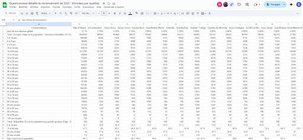
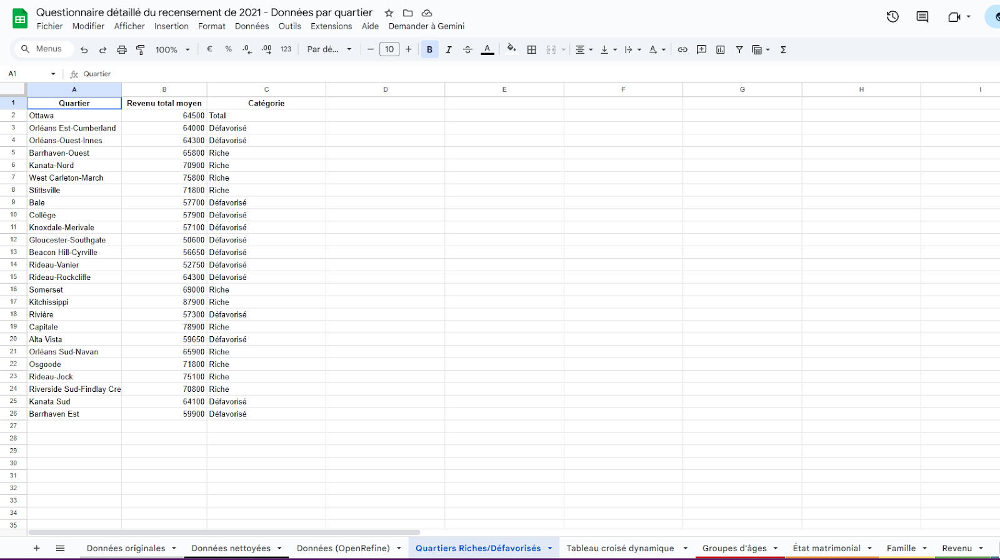
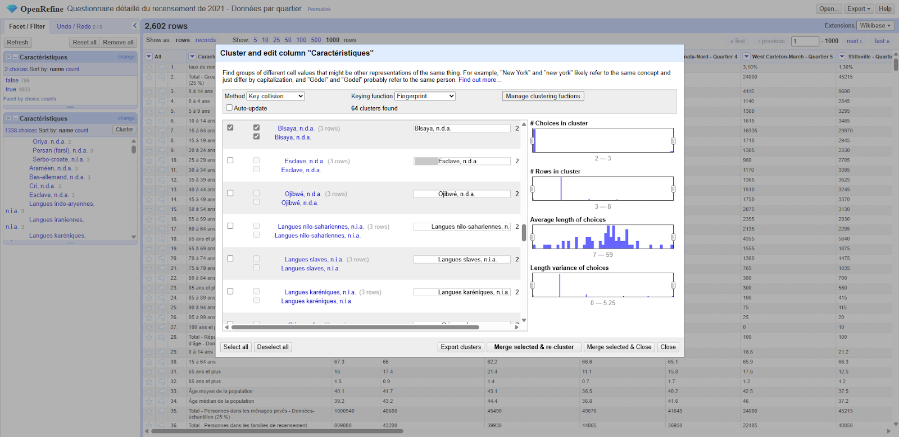
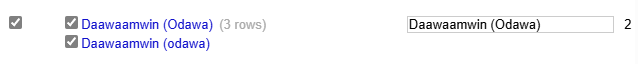
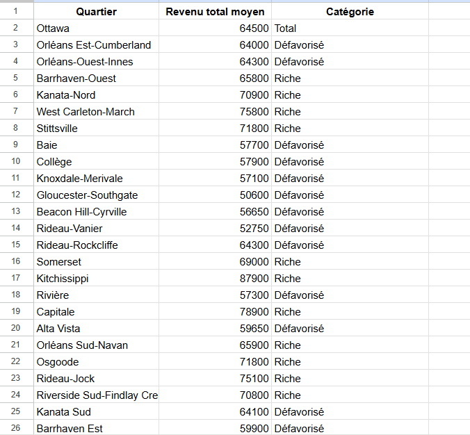
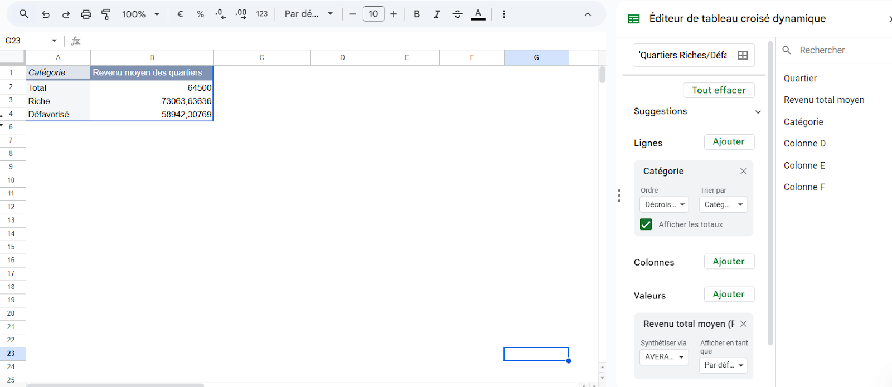
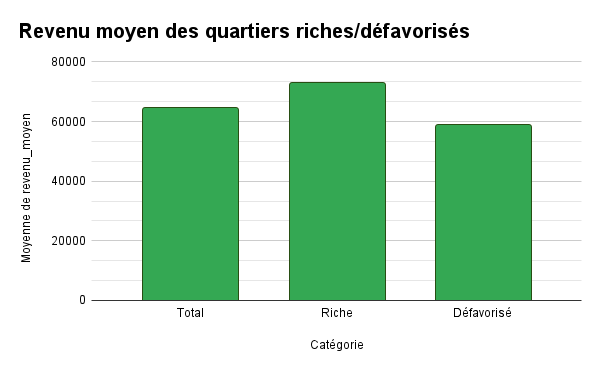

**7 novembre 2025** 
**CMN4500/JOU4500 Journalisme numérique II** 
**Alice Rosange Mbela Ebele, Catherine Brideau, Mackenzie Moffatt** 
**Présenté à Jean-Sébastien Marier** 

# Analyse exploratoire de données (AED) et proposition

## Avant-propos

Ce projet s’appuie sur le jeu de données « Questionnaire détaillé du recensement de 2021 – Données par quartier » publié par la Ville d’Ottawa. En analysant ces données, l’objectif est d’explorer (...) des quartiers d’Ottawa afin de mieux comprendre les dynamiques locales. Cette analyse exploratoire servira à analyser les données en profondeur pour le projet final.

## 1. Introduction

Le projet s’appuie sur les données du recensement 2021 pour Ottawa, compilées par Statistique Canada. Elles incluent des variables clés telles que l’âge, le revenu, les langues, le statut matrimonial, le logement et l’emploi. Les données ont été nettoyées et structurées afin de permettre une analyse comparative entre les quartiers riches et défavorisés d’Ottawa. Les différentes sections de ce travail sont les suivantes: l’obtention des données suivi par la compréhension de celles-ci, une analyse VIMA, le nettoyage des données par l’entremise des outils de Google Feuille de Calcul, le logiciel OpenRefine, etc., Analyse exploratoire des données (AED) et finalement la possibilité d’un récit potentiel et/ou un angle pour la suite du travail.

* [Lien vers le jeu de données original sur Ottawa ouverte](https://ouverte.ottawa.ca/datasets/ottawa::questionnaire-d%C3%A9taill%C3%A9-du-recensement-de-2021-donn%C3%A9es-par-quartier/about)
* [Lien vers la version CSV sur du portail GitHub du prof](https://raw.githubusercontent.com/jsmarier/files-for-course-assignments/refs/heads/main/Questionnaire_d%C3%A9taill%C3%A9_du_recensement_de_2021_Donn%C3%A9es_par_quartier.csv)

## 2. Obtenir les données

 
###### *Figure 1 : La capture d'écran Intiale lors de l'importation du Jeu de Données dans Excel.*

Pour importer les données dans Google Feuille de Calcul, nous avons commencé par télécharger le fichier CSV dans mon ordinateur. Prochainement, nous avons été dans Google Feuille de calcul et créé une nouvelle feuille de calcul. Nous avons continué par cliquer sur fichier et importé le fichier CSV.

#### Nombre de Colonnes:
Il y a 26 colonnes dans le jeu de données.
Il y a 2248 lignes dans le jeu de données. (Incluant la ligne de titres)

#### Est-ce que les données semblent-elles propres?
À première vue, l’alignement de certaines cases est à droite au lieu d’être à gauche. Il y a quelques espaces avant certains mots. Par exemple, sur le ligne 532 (langues autochtones). Un manque de majuscules pour certains mots dans la colonne caractéristiques. Par exemple, sur la ligne 2, le mot taux n’a pas de majuscule, alors qu’il l’est plus loin dans le jeu de données.

###### Colonne A
Dans la colonne A, les données sont nominales. Ces données nominales représentent des catégories représentatives sur les quartiers. Par exemple, le total de groupes d’âge de la population et en dessous, chaque groupes d’âge individuel séparés. 

###### Colonne B
Dans la colonne B, les données sont numériques. Ce sont des nombres qu’on peut additionner ou soustraire, ou pour des comparaisons pour des calculs statistiques.

###### Colonne C
Dans la colonne C jusqu'à la fin, ce sont des données quantitatives discrètes parce qu’on compte des individus et parce que des comptages de personnes ne peuvent pas prendre une infinité de valeurs.

##### Angle Potentiel
Comparer les revenus moyens entre les quartiers riches et défavorisés.

##### Question ou hypothèse
Pourquoi certains quartiers d’Ottawa ont un salaire plus élevé que d’autres?

 
*Figure 1 : La fenêtre d'importation d'un fichier de Google Feuilles de calcul.*

## 3. Comprendre les données

### 3.1. Analyse VIMA

La colonne C, soit celle du quartier Orléans Est-Cumberland, ne présente aucune donnée invalides. À première vue, pour donner un exemple, le Total - Répartition (%) de la population par grands groupes d'âge - Données-échantillon (25 %), équivaut à 100%. Chaque colonne vis à vis cette rangée présente la même chose. Ensuite, aucune des rangées dans la colonne C ne comporte des données vides (à part, pour les gens âgés de 100 et plus pour ce quartier en particulier, mais qui ne me semble pas impossible) ou bien la rangée 29 à 32 de cette colonne (soit le pourcentage divisé du Total - Répartition (%) de la population par grands groupes d'âge - Données-échantillon (25 %)), qui est bel et bien divisé pour avoir un total de 100%. Il n’y a pas de valeurs manquantes dans cette colonne. Finalement, je ne vois pas de données aberrantes. 

### 3.2. Nettoyage des données

Pour nettoyer les données, nous avons principalement utilisé les outils de nettoyage dans google feuille de calcul. Nous avons facilement supprimer les doublons et les espaces vides grâce à ces deux outils. Nous avons quand même passé à travers la feuille de calcul pour voir si ça faisait du sens. Nous avons aussi utilisé l’outil pour aligner les colognes pour qu’elles soient toutes alignées sur le bord droit. De plus, nous avons vérifié l'orthographe en utilisant l’outil d'orthographe. 

Nous avons figé la première ligne du jeu de données (celle comportant les colonnes caractéristiques et les noms de quartiers). Par la suite, nous avons fait de même avec la première colonne, soit celle des caractéristiques, puisqu’elle permet la compréhension de notre jeu de données.

 

Ensuite, nous avons aussi fait plusieurs feuilles dans le document afin d’analyser et nettoyer les données selon les différentes catégories (Ex: âge, revenu, etc.) La capture d’écran démontre l’une de ces feuilles (au bas il y a les autres feuilles avec des codes de couleurs). 

 

Nous avons fait une analyse avec le système OpenRefine. 
 

Dans cette analyse, nous avons utilisé l’outil cluster, pour voir s’il y avait des noms semblables sous différentes itérations ou des espaces devant les mots qui divisaient les catégories. Un exemple de ceci, serait les deux catégories: Khmer (cambogien) ou cambogien (khmer). Nous avons décidé de mettre ces lignes sous le nom: Khmer (cambogien), puisque dans ce cas-ci le khmer est la langue parlée.

*D’autres exemples d’OpenRefine:*
 
 

Nous avons ensuite sauvé cette analyse du logiciel OpenRefine, dans notre document Excel. Il a ensuite été nommé.
 

### 3.3. Analyse exploratoire des données (AED)

##### Résumé exécutif (chiffres clés)

* Revenu moyen - Quartiers Riche: 73 063,64$.
* Revenu moyen - Quartiers Défavorisé: 58 942,31$.
* Écart absolu: 73 063,64 - 58 942,31 = 14 121,33$.
* Écart relatif: 14 121,33 ÷ 58 942,31 ≈ 0,2396 → 23,96 % (les quartiers riches ont en moyenne ~24 % de revenu en plus que les quartiers défavorisés).
* Moyenne «Total (Ottawa)»: 64 500$ (repère global).
* Riche vs ensemble: ≈  +13,3 % Défavorisé vs ensemble: ≈  -8,6 %.

##### Processus/démarche (ce qu’on a fait et pourquoi)

###### 1. Choix des variables
* Revenu total moyen (indicateur monétaire direct de niveau de vie)
* Catégorie (Riche vs Défavorisé). C’est la variable de groupe qu’on souhaite comparer. Ces deux variables nous aident à analyser notre angle (comparer les revenus moyens entre les quartiers riches et défavorisés à Ottawa).
* Vérification rapide des données visibles pour obtenir les moyennes par groupe et le total.
Calculs sommaires: différence absolue et relative.
* Nous avons gardé en tête que les moyennes peuvent être influencées par des valeurs très hautes ou très basses. Il est aussi important de tenir compte de la taille de la population ou du nombre de bénéficiaires si on veut mesurer l’impact sur les personnes plutôt que sur les quartiers.
###### 2. Principales conclusions
* Il a un écart substantiel: ~14 k$ d’écart moyen entre les groupes, c’est économiquement significatif (≈24 %).
* Les quartiers «Riche» ont un revenu moyen au-dessus de la moyenne d’Ottawa (≈73 k$ vs 64,5 k$), tandis que les quartiers «Défavorisés» sont en dessous (≈59 k$). 
* Les quartiers riches dépassent la moyenne ville d’environ 13 %; les défavorisés sont ~9 % en dessous.
* L’écart montre une séparation économique claire entre les quartiers riches et les quartiers pauvres.

###### 3. Ce qu’il faut vérifier / ce qui peut biaiser l’interprétation
* Moyenne vs médiane: La moyenne peut être faussée par quelques quartiers très riches, donc il faut aussi comparer les médianes entre les catégories.
* Pondération par nombre de bénéficiaires / population: La moyenne des moyennes de quartiers n’est pas la même que la moyenne par personne si les quartiers ont des tailles différentes. Pour un portrait plus juste, il faut utiliser une moyenne pondérée selon le nombre de bénéficiaires.
* Distribution: Il faut regarder l’écart-type pour savoir si la différence moyenne vient d’un changement général ou seulement de quelques valeurs extrêmes.

###### 4. L’histoire / interprétation
* Les quartiers dits «riches» ont en moyenne des revenus beaucoup plus élevés que les quartiers «défavorisés», ce qui montre une inégalité de revenu entre les zones d’Ottawa. Cette différence peut aussi affecter l’accès au logement, aux services, à l’éducation et aux emplois dans ces quartiers.

###### 5. Variables et nombres méritant une analyse plus poussée
* Comparer les médianes (par groupe) pour réduire l’effet des outliers.
* Calculer la moyenne pondérée par population (ou par nombre de bénéficiaires).

 

 

 
*Figure 2 : Ce tableau croisé dynamique montre le revenu moyen des quartiers riches versus les quartiers défavorisés.*

## 4. Récit potentiel

Des quartiers tels que Vanier ou Rideau-Vanier, moins privilégiés à Ottawa, se démarquent de Barrhaven ou Kanata, qui sont plus aisés, principalement en raison de disparités socio-économiques relatives aux revenus, au niveau d’instruction, à l’accès à l’emploi et à la qualité des habitations. Les foyers résidant dans des régions défavorisées affichent généralement un revenu médian inférieur, un taux de chômage plus important et une prédominance de locataires sur les propriétaires, entravant ainsi leur stabilité financière. En revanche, les zones plus riches jouissent d'un meilleur accès aux services, à des établissements scolaires mieux équipés, à des carrières qualifiées et à des infrastructures contemporaines, ce qui attire des habitants avec un revenu supérieur et maintient un cycle vertueux de prospérité.

Par conséquent, les différences constatées entre ces zones peuvent être attribuées à une conjonction de facteurs structurels - tels que l'aménagement urbain, la présence de logements abordables et les stratégies d'investissement municipales - qui exacerbent les disparités économiques et sociales au sein de la cité. Des sources pertinentes seraient: « Plan d’améliorations communautaires pour le logement abordable», « Statistiques trimestrielles sur les loyers, premier trimestre de 2019 au premier trimestre de 2025 », etc. Nous voulons parler avec des habitants de régions opposées (quartiers plus pauvres versus quartiers plus riches). 

## 5. Conclusion

Lors de ce travail, l’une des choses qui a été plus difficile serait le nettoyage des données. Dans ce sens, le doute qu’il y eut en se demandant si les données avaient bel et bien toutes étés nettoyées. D’un autre côté, lors de la création du tableau croisé dynamique, c’était un défi de choisir qu’elles données utilisés vis qu’il y en a beaucoup. Finalement, l’utilisation du programme Studio Visual Code a été très difficile à comprendre pour toute l’équipe. Ce qui a été gratifiant, par contre, c’est pouvoir utiliser ces outils appris en classe dans le contexte d’un travail. On a toutes réalisé qu’on savait moins qu’on pensait, surtout vu que c’est un gros jeu de données. Il a fallu revenir sur les concepts clés appris en classe et dans les modules asynchrones pour comprendre. On aurait voulu étudier les concepts et la matière davantage afin d’être moins perdus, d’avoir plus des connaissances pratiques.

## 6. Références

City of Ottawa. (2021). Questionnaire détaillé du recensement de 2021 — Données par quartier [Dataset]. Open Ottawa. [https://ouverte.ottawa.ca/datasets/ottawa::questionnaire-d%C3%A9taill%C3%A9-du-recensement-de-2021-donn%C3%A9es-par-quartier/about](https://ouverte.ottawa.ca/datasets/ottawa::questionnaire-d%C3%A9taill%C3%A9-du-recensement-de-2021-donn%C3%A9es-par-quartier/about)

Fridfinnson, L. (2022, 3 juin). ‘What matters most is the people.’ Housing and cost of living front of mind for Ottawa‑Vanier voters as they elect a Liberal — again. Capital Current.[https://capitalcurrent.ca/what-matters-most-is-the-people-housing-and-cost-of-living-front-of-mind-for-ottawa-vanier-voters/](https://capitalcurrent.ca/what-matters-most-is-the-people-housing-and-cost-of-living-front-of-mind-for-ottawa-vanier-voters/)

Jean-Sébastien Marier, (2021, 10 octobre). Nettoyer des données dans Google Feuilles de calcul [Vidéo]. YouTube.[https://youtu.be/5dCq2I_YokI](https://youtu.be/5dCq2I_YokI)

Jean-Sébastien Marier, (2021, 19 octobre). Créer un graphique combiné dans Google Feuilles de calcul [Vidéo]. YouTube.[https://youtu.be/9YXh-zUGCa0](https://youtu.be/9YXh-zUGCa0)

Jean-Sébastien Marier, (2021, 19 octobre). Utiliser les tableaux croisés dynamiques dans Google Feuilles de calcul [Vidéo].Youtube. [YouTube. https://youtu.be/9YXh-zUGCa0](https://youtu.be/9YXh-zUGCa0)

Jean-Sébastien Marier, (2021, 19 octobre). Techniques de base d’analyse de données [Vidéo]. YouTube. [https://youtu.be/IovDb2v_cr4](https://youtu.be/IovDb2v_cr4)

Jean-Sébastien Marier, (2021, 21 novembre). Créer des graphiques simples avec Datawrapper [Vidéo]. YouTube. [https://youtu.be/aitI3KlKV1I](https://youtu.be/aitI3KlKV1I)

Statistique Canada. (2025, 25 juin). Statistiques trimestrielles sur les loyers, premier trimestre de 2019 au premier trimestre de 2025. Le Quotidien. [https://www150.statcan.gc.ca/n1/daily-quotidien/250625/dq250625b-fra.htm](https://www150.statcan.gc.ca/n1/daily-quotidien/250625/dq250625b-fra.htm)

Ville d’Ottawa. (n.d.). Plan d’améliorations communautaires pour le logement abordable. [https://ottawa.ca/fr/programmes-et-projets/plans-dameliorations-communautaires/plan-dameliorations-communautaires-pour-le-logement-abordable](https://ottawa.ca/fr/programmes-et-projets/plans-dameliorations-communautaires/plan-dameliorations-communautaires-pour-le-logement-abordable)
